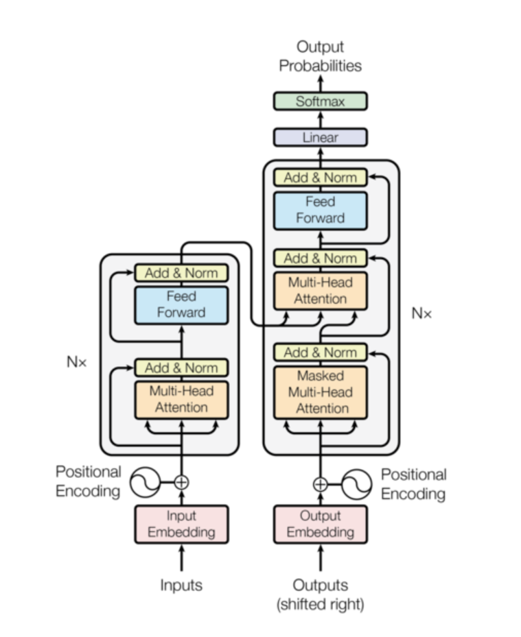
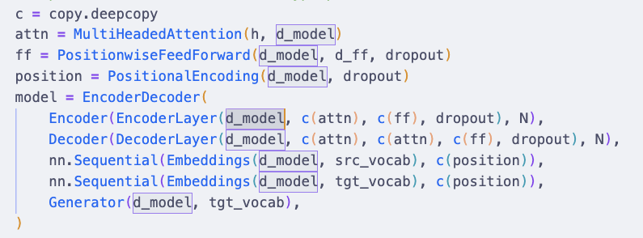

For my assignment, I have to partially implement the T5 transformer model. However, the only thing I have for implementing it is intuition. I don't understand many parts of it deeply enough. And the full code for the implementation is sprawling - and also, because of its sprawling nature, makes breaking down the components difficult. 

There is quite a good guide for it [here](https://nlp.seas.harvard.edu/annotated-transformer/), where the authors take us through each aspect of its implementation with notes. I think this is a good starting point. 

In this post, I'll mainly be commenting on the things I don't understand as well making detailed notes on each aspects of the implementation as I go along. 



### The full model
```python
def make_model(
    src_vocab, tgt_vocab, N=6, d_model=512, d_ff=2048, h=8, dropout=0.1
):
    "Helper: Construct a model from hyperparameters."
    c = copy.deepcopy
    attn = MultiHeadedAttention(h, d_model)
    ff = PositionwiseFeedForward(d_model, d_ff, dropout)
    position = PositionalEncoding(d_model, dropout)
    model = EncoderDecoder(
        Encoder(EncoderLayer(d_model, c(attn), c(ff), dropout), N),
        Decoder(DecoderLayer(d_model, c(attn), c(attn), c(ff), dropout), N),
        nn.Sequential(Embeddings(d_model, src_vocab), c(position)),
        nn.Sequential(Embeddings(d_model, tgt_vocab), c(position)),
        Generator(d_model, tgt_vocab),
    )

    # This was important from their code.
    # Initialize parameters with Glorot / fan_avg.
    for p in model.parameters():
        if p.dim() > 1:
            nn.init.xavier_uniform_(p)
    return model

test_model = make_model(11, 11, 2)
```
So instead of going through the details of the implementation of each component, let's take a look at the entire model/pipeline. 

We see that the process of constructing this model is to define a `src_vocab` and a `tgt_vocab`, and a whole bunch of hyper parameters. `d_model` is the dimensions of the model - this is featured constantly as the input for all the components. 



**What exactly are model dimensions?**

According to chatGPT, `d_model` is the dimension of the embeddings and hidden representations throughout the entire transformer. 

Specifically this means:
- Every token is represented by a vector of size d_model
- Every layer in both encoder and decoder works with vectors of this dimension
- The attention, feed-forward layers, and positional encodings all assume inputs of dimension d_model

`d_model` basically refers to the width of the model, or rather, the number of features each token embedding has, or the number of neurons per layer in a network. Your `n_a` value, basically. Now that's way clearer. In the original transformer, d_model was 512 - in BERT based, it was 768, and by the time of GPT-3, it's 12,288. 

Again, if our input sentence has 10 tokens:
```python
[ [0.2, 0.7, ..., 0.5],   # token 1
  [0.1, 0.9, ..., 0.6],
  ...
  [0.3, 0.8, ..., 0.4] ]  #←  shape = (10, 512)
```
Most layers practically preserve this shape.

### Now what exactly is d_ff? 
`d_ff` is mainly invoked in this line:
`ff = PositionwiseFeedForward(d_model, d_ff, dropout)`

And used in the definition of the FeedForward:
```python
class PositionwiseFeedForward(nn.Module):
    "Implements FFN equation."

    def __init__(self, d_model, d_ff, dropout=0.1):
        super(PositionwiseFeedForward, self).__init__()
        self.w_1 = nn.Linear(d_model, d_ff)
        self.w_2 = nn.Linear(d_ff, d_model)
        self.dropout = nn.Dropout(dropout)

    def forward(self, x):
        return self.w_2(self.dropout(self.w_1(x).relu()))
```
This makes it super simple then: **it is the dimensions of the feedforward layer**, which is a 2 layer neural network with first layer having 2048 nodes (and expecting 512 connections) and second layer having 512 nodes.


### Back to the model

Basically, in this instantiation of the model, you're defining the multi-headed attention, feed forward, positional encoding, your entire Encoder-decoder layers, along with the the individual src_embeddings, tgt_embeddings, generators. 

### Now, let's take a look at the `h=8` hyperparameter. 
This is used mainly in your multiHeadAttention:
`attn = MultiHeadedAttention(h, d_model)`

I think this is pretty straightforward. It defines the number of heads in this multi-head attention. 

## Tracing the data flow
At this point, I think it's a good idea to trace the flow of inputs throughout the model to figure out what exactly is going into what, where. 

I'll construct a basic nested tree graph to illustrate the sequence of data flows:
- EncoderDecoder
    - Encoder
        - EncoderLayer
            - self_attn (MultiHeadedAttention(h, d_model))
            - feed_forward (PositionwiseFeedForward(d_model, d_ff, dropout))
            - sublayer (clones(SublayerConnection(size, dropout), 2))
                - LayerNorm
                - Dropout
    - Decoder
        - DecoderLayer
            - self_attn (MultiHeadedAttention(h, d_model))
            - src_attn (MultiHeadedAttention(h, d_model))
            - feed_forward (PositionwiseFeedForward(d_model, d_ff, dropout))
            - sublayer (clones(SublayerConnection(size, dropout), 3))
                - LayerNorm
                - Dropout

Alright, great - now let's go down sequence by sequence to see what happens to the data when you pass into this model. 

For our purposes, a simple invocation would be as follows:
```python
test_model = make_model(11, 11, 2) # src_vocab, tgt_vocab, N=2
test_model.eval()

src = torch.LongTensor([[1, 2, 3, 4, 5, 6, 7, 8, 9, 10]])
src_mask = torch.ones(1, 1, 10)

memory = test_model.encode(src, src_mask)
ys = torch.zeros(1, 1).type_as(src)
for i in range(9):
    out = test_model.decode(
        memory, src_mask, ys, subsequent_mask(ys.size(1)).type_as(src.data)
    )
    prob = test_model.generator(out[:, -1])
    _, next_word = torch.max(prob, dim=1)
    next_word = next_word.data[0]
    ys = torch.cat(
        [ys, torch.empty(1, 1).type_as(src.data).fill_(next_word)], dim=1
    )

print("Example Untrained Model Prediction:", ys)
```


### Step 0: Fleshing out the encoder instance:
Let's take a look at the very first things that happen as well as the objects and states that are being defined. 

First, a `make_model(11, 11, 2)` is ran, which instantiates an EncoderDecoder() object, with the following properties:
```python
model = EncoderDecoder(
    encoder = Encoder(EncoderLayer(size = d_model=512, self_attn = MultiHeadedAttention(8, 512), feed_forward=PositionwiseFeedForward(512, 2048, 0.1), dropout=0.1), N=2),
    decoder = Decoder(DecoderLayer(size = d_model=512, self_attn = MultiHeadedAttention(8, 512), src_attn = MultiHeadedAttention(8, 512), feed_forward=PositionwiseFeedForward(512, 2048, 0.1), dropout=0.1), N=2),
    src_embed = nn.Sequential(Embeddings(512, 11), c(PositionalEncoding(512, 0.1))),
    tgt_embed = nn.Sequential(Embeddings(512, 11), c(PositionalEncoding(512, 0.1))),
    generator = Generator(512, 11)

)
```
Most of these are therefore defined from the outset. 

#### Invoking model.encode
So the next step does: `memory = test_model.encode(src, src_mask)`

```python
memory = test_model.encode(src, src_mask)

# src = torch.LongTensor([[1, 2, 3, 4, 5, 6, 7, 8, 9, 10]])
# src_mask = torch.ones(1, 1, 10)
```
So here's the thing. It might be a little confusing what this ` EncoderDecoder.encode()` method does, since if we look at the definition of this method in the EncoderDecoder:
```python
class EncoderDecoder:
...
    def _init_(self, encoder):
        self.encoder = encoder
...
    def encode(self, src, src_mask):
        return self.encoder(self.src_embed(src), src_mask)
```
We seem to be simply calling the Encoder that we've specified in the instantiation of the EncoderDecoder:

```python
Encoder(EncoderLayer(size = d_model=512, self_attn = MultiHeadedAttention(8, 512), feed_forward=PositionwiseFeedForward(512, 2048, 0.1), dropout=0.1), N=2)
```

#### It turns out, that when we're calling the Encoder() object itself, we're simply calling the `.forward()` method of the Encoder. Which, in this case, is defined like so:

```python
    def forward(self, x, mask):
        "Pass the input (and mask) through each layer in turn."
        for layer in self.layers:
            x = layer(x, mask)
        return self.norm(x)
```

So the values of `src_embed(src), and src_mask` are essentially your `x` and `mask` arguments. 

### Let's go back to the data flow. 
First, our x values are defined as `src`, which is a `torch.LongTensor([[1, 2, 3, 4, 5, 6, 7, 8, 9, 10]])`. 

It's just a 1D array of X values of shape (1, 10). 

At the first step, this is invoked: `test_model.encode(src, src_mask)`

At this stage, 
x = [[1, 2, 3, 4, 5, 6, 7, 8, 9, 10]] -> (1, 10)
src_mask = [[[1., 1., 1., 1., 1., 1., 1., 1., 1., 1.]]] -> (1, 1, 10)

The encode function further wraps it up in:
`self.encoder(self.src_embed(src), src_mask)`
Which alters x values with fn src_embed, before passing it into the forward function. 

**src_embed** function: 
```python
src_embed = nn.Sequential(
    Embeddings(512, 11),  # turns token IDs into vectors
    c(PositionalEncoding(512, 0.1))  # adds positional info
)
```
`nn.Sequential(Embeddings(512, 11), c(PositionalEncoding(512, 0.1)))`

Now, what exactly does this function do to my x values? 

nn.Sequential basically chains linear layers for forward pass. In this case, this is equivalent of threading: 
-> Embeddings(512, 11) (x) 
   c(PositionalEncoding(512, 0.1) (x)

So during my invocation, x is transformed by src_embed(x), before being passed into the encoder proper. 

### Understanding the src_embed transformation
Or rather, understanding its constituents, the `Embeddings` transformation, followed by `PositionalEncoding` transformation.

```python
class Embeddings(nn.Module):
    def __init__(self, d_model, vocab):
        super(Embeddings, self).__init__()
        self.lut = nn.Embedding(vocab, d_model) # lut = look up table
        self.d_model = d_model

    def forward(self, x):
        return self.lut(x) * math.sqrt(self.d_model)
```

So let's take a look at what it does. Note that our d_model = 512, and the vocab is 11. So the `nn.Embedding(vocab, d_model)` would be `nn.Embedding(11, 512)`

Notice what this creates: 

```python
In [54]: em3 = nn.Embedding(11, 512)

In [55]: em3.weight
Out[55]: 
Parameter containing:
tensor([[-0.6450,  0.2570,  1.0974,  ..., -0.1953,  1.5559,  0.6524],
        [-0.4659, -0.2695, -0.1779,  ..., -0.8466,  0.3604, -0.0133],
        [-0.3017, -0.7222, -0.1026,  ...,  0.8798, -0.4437,  1.9271],
        ...,
        [-0.1964, -1.9344,  0.3504,  ...,  0.8637, -1.6140, -1.1681],
        [-0.5829,  0.6468,  0.8407,  ..., -0.0552,  0.2958,  0.2268],
        [ 2.5061, -0.8058,  1.4378,  ...,  1.1201,  0.7154,  1.4225]],
       requires_grad=True)

In [56]: em3.weight.shape
Out[56]: torch.Size([11, 512])
```

Next, we look at the forward method. This basically transforms x into:

x -> lut(x) -> ~ nn.Embedding(11, 512)(x) -> nn.Embedding(11, 512)(x) * sqrt(512)

Given that our x is shape (1, 10), with a list of integers, this outputs:
```python
In [60]: em3(x)
Out[60]: 
tensor([[[-0.4659, -0.2695, -0.1779,  ..., -0.8466,  0.3604, -0.0133],
         [-0.3017, -0.7222, -0.1026,  ...,  0.8798, -0.4437,  1.9271],
         [-0.5014,  1.2704,  1.0993,  ...,  0.2362,  0.8876, -0.2356],
         ...,
         [-0.1964, -1.9344,  0.3504,  ...,  0.8637, -1.6140, -1.1681],
         [-0.5829,  0.6468,  0.8407,  ..., -0.0552,  0.2958,  0.2268],
         [ 2.5061, -0.8058,  1.4378,  ...,  1.1201,  0.7154,  1.4225]]],
       grad_fn=<EmbeddingBackward0>)

In [61]: em3(x).shape
Out[61]: torch.Size([1, 10, 512])

```
Which means that it transforms a input of shape (1, 10) into (1, 10, 512) -> this basically means that it queried the indexes of each item in the array (1 to 10), and returned the embedding vectors of 512 shape long. Think of it as a 2D vector of shape (1, 10) being filled up with depth of 512. So it's a very long and thin surface now. 

#### Alright, back to our data flow! To recap: 
We created x (src) with:

`src = torch.LongTensor([[1, 2, 3, 4, 5, 6, 7, 8, 9, 10]])`

`src_mask = torch.ones(1, 1, 10)`

And then through `model.encode(src, src_mask)`, which propagated x as follows:

`Encoder(src_embed(src), src_mask)`, and src_embed is a function defined as follows:

```python
nn.Sequential(Embeddings(d_model, src_vocab), c(position))
```
We arrive at the following chain of transformations on x (I'll add the position fn below):

```python
emb = Embeddings(512, 11)
In [60]: emb(x)
Out[60]: 
tensor([[[-0.4659, -0.2695, -0.1779,  ..., -0.8466,  0.3604, -0.0133],
         [-0.3017, -0.7222, -0.1026,  ...,  0.8798, -0.4437,  1.9271],
         [-0.5014,  1.2704,  1.0993,  ...,  0.2362,  0.8876, -0.2356],
         ...,
         [-0.1964, -1.9344,  0.3504,  ...,  0.8637, -1.6140, -1.1681],
         [-0.5829,  0.6468,  0.8407,  ..., -0.0552,  0.2958,  0.2268],
         [ 2.5061, -0.8058,  1.4378,  ...,  1.1201,  0.7154,  1.4225]]],
       grad_fn=<EmbeddingBackward0>)

In [61]: emb(x).shape
Out[61]: torch.Size([1, 10, 512])
# position = PositionalEncoding(d_model, dropout)
# c = copy.deepcopy
c(position(emb(x)))
```

And thus we arrive at `c(position(emb(x)))` which is the actual processed x values that gets passed into the forward pass of the Encoder!

```python
class Encoder(nn.Module):
    "Core encoder is a stack of N layers"

    def __init__(self, layer, N):
        super(Encoder, self).__init__()
        self.layers = clones(layer, N)
        self.norm = LayerNorm(layer.size)

    def forward(self, x, mask):
        "Pass the input (and mask) through each layer in turn."
        for layer in self.layers:
            x = layer(x, mask)
        return self.norm(x)
```

### The forward pass of the encoder
Great - we have reached so far, as to see the transformations needed before we enter the forward pass of the encoder. 

Now, what's happening in the forward pass? 

First, we see that there are essentially N layers, where each layers is a clone of each other. Now, the `layer` itself was defined in the instantiation of the Encoder: 

```python
encoder = Encoder(EncoderLayer(size = d_model=512, self_attn = MultiHeadedAttention(8, 512), feed_forward=PositionwiseFeedForward(512, 2048, 0.1), dropout=0.1), N=2)

-> EncoderLayer(size = d_model=512, self_attn = MultiHeadedAttention(8, 512), feed_forward=PositionwiseFeedForward(512, 2048, 0.1)
```
So it is this layer defined as such: `EncoderLayer(512, MultiHeadAttention(8, 512), PositionwiseFeedForward(512, 2048, 0.1))`

Which means that it is quite a dense forward function. Let's try to further break down what it does. 

### The Encoder Layer
The following is the definition of the EncoderLayer:
```python
class EncoderLayer(nn.Module):
    "Encoder is made up of self-attn and feed forward (defined below)"

    def __init__(self, size, self_attn, feed_forward, dropout):
        super(EncoderLayer, self).__init__()
        self.self_attn = self_attn
        self.feed_forward = feed_forward
        self.sublayer = clones(SublayerConnection(size, dropout), 2)
        self.size = size

    def forward(self, x, mask):
        "Follow Figure 1 (left) for connections."
        x = self.sublayer[0](x, lambda x: self.self_attn(x, x, x, mask))
        return self.sublayer[1](x, self.feed_forward)
```
Let's again trace the data flow within the encoding layer. 

Assuming that your x is now defined as `c(position(emb(x)))`. You're now passing x into some sublayers. But what are sublayers? 

#### EncoderLayer.sublayer 
So this layer is defined by `self.sublayer = clones(SublayerConnection(size, dropout), 2)`. 

But what is SublayerConnection(), and what exactly does clones do?

```python
class SublayerConnection(nn.Module):
    """
    A residual connection followed by a layer norm.
    Note for code simplicity the norm is first as opposed to last.
    """

    def __init__(self, size, dropout):
        super(SublayerConnection, self).__init__()
        self.norm = LayerNorm(size)
        self.dropout = nn.Dropout(dropout)

    def forward(self, x, sublayer):
        "Apply residual connection to any sublayer with the same size."
        return x + self.dropout(sublayer(self.norm(x)))

```
Sublayer connection seems to mainly be residual connections. Specifically, the transformation is mainly:

x + dropout(sublayer(norm(x))) -> where the sublayer function is defined on invocation of SublayerConnection, which is found in the EncoderLayer `SublayerConnection(size, dropout)`. 

#### However, the line:

```python
class EncoderLayer(nn.Module):
...
    def __init__(self, size, self_attn, feed_forward, dropout):
...
        self.sublayer = clones(SublayerConnection(size, dropout), 2)
```

Is **not** the function call. This is the call to the function **constructor**. This is where the SublayerConnection objects are created but not invoked yet. They're created with size=512, and 0.1. So, the following object created: `SublayerConnection(512, 0.1)`

The actual place this sublayer is invoked is at: 

```python
class EncoderLayer(nn.Module):
...
    def forward(self, x, mask):
        "Follow Figure 1 (left) for connections."
        x = self.sublayer[0](x, lambda x: self.self_attn(x, x, x, mask))
        return self.sublayer[1](x, self.feed_forward)
```

Where sublayer[0](x, b) -> b is the function that's passed into the sublayer function, which in this case, `b= lambda x: self.self_attn(x, x, x, mask)`

So. The forward function of EncoderLayer thus becomes:
`x + self.dropout(sublayer(self.norm(x)))` -> `x + dropout(self_attn(self.norm(x), self.norm(x), self.norm(x), mask))`

### Let's recurse back into our chain and piece things together. 
First we have our x is which defined as `c(position(emb(x)))`, and this gets passed into the forward pass of the Encoder:

```python
class Encoder(nn.Module):
    "Core encoder is a stack of N layers"

    def __init__(self, layer, N):
        super(Encoder, self).__init__()
        self.layers = clones(layer, N)
        self.norm = LayerNorm(layer.size)

    def forward(self, x, mask):
        "Pass the input (and mask) through each layer in turn."
        for layer in self.layers:
            x = layer(x, mask)
        return self.norm(x)
```

In this forward pass, x is repeatedly processed by the `layer` function, which is defined as EncodingLayers() because:

`Encoder(EncoderLayer(size = d_model=512, self_attn = MultiHeadedAttention(8, 512), feed_forward=PositionwiseFeedForward(512, 2048, 0.1), dropout=0.1), N=2)`

Which means that x is repeatedly passed into the forward function of `EncoderLayer`. The EncoderLayer's forward function is defined as:

```python
class EncoderLayer(nn.Module):
...
    def forward(self, x, mask):
        "Follow Figure 1 (left) for connections."
        x = self.sublayer[0](x, lambda x: self.self_attn(x, x, x, mask))
        return self.sublayer[1](x, self.feed_forward)
```

Within this forward function, we see x being processed by the sublayer function. This sublayer function is defined as the forward function of this constructor:

```python
class EncoderLayer(nn.Module):
...
    def __init__(self, size, self_attn, feed_forward, dropout):
        ...
        self.sublayer = clones(SublayerConnection(size, dropout), 2) # <--- DEFINED HERE
```
And looking at SublayerConnections

```python
class SublayerConnection(nn.Module):
    """
    A residual connection followed by a layer norm.
    Note for code simplicity the norm is first as opposed to last.
    """

    def __init__(self, size, dropout):
        super(SublayerConnection, self).__init__()
        self.norm = LayerNorm(size)
        self.dropout = nn.Dropout(dropout)

    def forward(self, x, sublayer):
        "Apply residual connection to any sublayer with the same size."
        return x + self.dropout(sublayer(self.norm(x)))
```
We see that the forward pass of the sublayer connections returns: `x + self.dropout(sublayer(self.norm(x)))`, which, given the sublayer function being defined in the lambda function, will expand to: 

`x + dropout(self_attn(self.norm(x), self.norm(x), self.norm(x), mask))`

...when actually invoked.

- Encoder
    - EncoderLayer
        - SubLayerConnection[0]
            - x + dropout(self_attn(self.norm(x), self.norm(x), self.norm(x), mask))
        - SubLayerConnection[1]
            - x + self.dropout(self.feed_forward(self.norm(x)))

So in the first Sublayer, what happens is:

1. Normalize the input x → norm(x)
2. Run multi-head self-attention on that normalized input (queries, keys, and values all come from the same sequence — hence “self-attention”)
3. Apply dropout
4. Add the result back to the original input x (residual connection)

In the second Sublayer, what happens is:
1. Normalize the input again
2. Apply the feed-forward network (two linear layers with ReLU in between)
3. Dropout
4. Add the residual connection

#### And there we're done! The value is returned as the output of one EncoderLayer! We now will do...N=6 times of this. 

Okay at this step, I still find it pretty hard to trace the series of data transformations. 

But let me give it a try. 

x = c(position(emb(x))) 
x = x + dropout(self_attn(self.norm(x), self.norm(x), self.norm(x), mask))
x = x + self.dropout(self.feed_forward(self.norm(x)))

Yep, this is practically just it!

In ChatGPT's words, one encoder layer performs:

“Normalize → Self-attend → Dropout → Add residual →
Normalize → Feed-forward → Dropout → Add residual.”

Okay this post is too long, will break it up into the next post. 